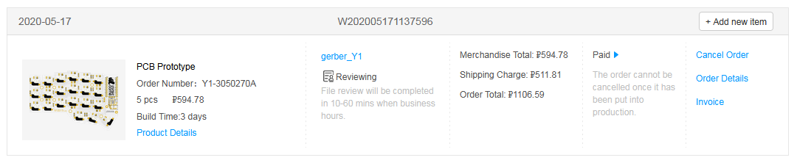
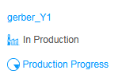
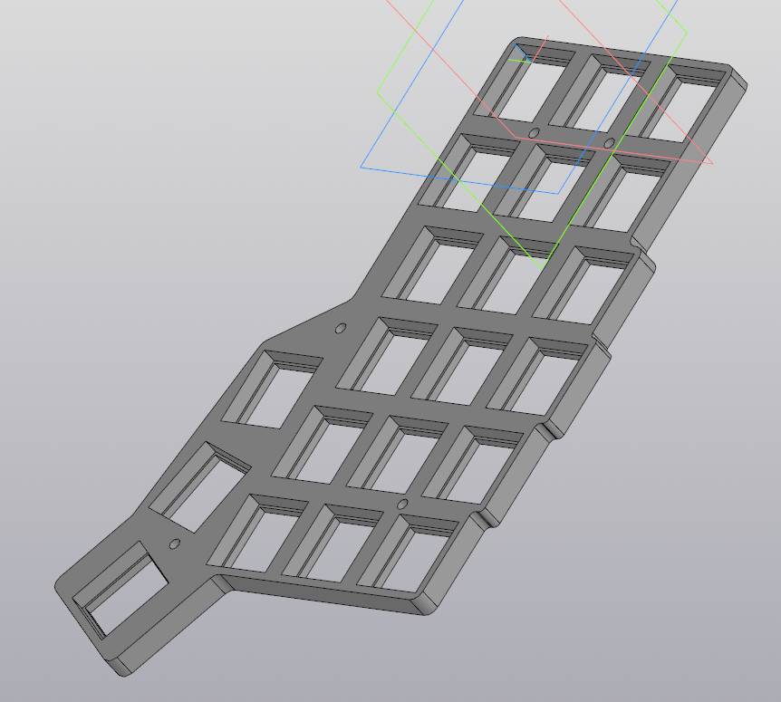

# LW Corne build log

## Entry 1 - 17.05.2020
Modified KiCAD corne-cherry pcb file to include some greets, don't judge me.

Exported gerber files, sent them to JLCPCB. Right now it's Sunday, so verification is taking a while. Total is 1107 rub (15\$), 595 rub (8\$) for 5 PCBs and 512 RUB (7\$) for postage. They should be here in ~30 days.

Decided on the switches that'll be used with tvrg, it's Kailh Navy Blues.

Cloned a qmk repo as a submodule to this one, so yeah, gonna prod it with a stick for a bit.

Total spent: 1107 rub (15\$)

## Entry 2 - 18.05.2020
Yeah boy.

What I bought on AE:
- 90 pcs Kailh Navy + 100 pcs Kailh sockets: 3849 rub (52.4\$)
- 4 pcs Arduino Pro Micro: 995 rub (13.5\$)
- 4 pcs OLED: 582 rub (7.9\$)
- 200 pcs 1n4148 diodes: 114 rub (1.5\$)
- 4 pcs encoders: 520 rub (7\$)

Total: 6060 rub (82.5$)

Total spent: 7167 rub (97,5$)

## Entry 3 - 19.05.2020
Extruded a plate file to be printable with a 3D printer. Thing is, 1.5mm 3D-printed plate would be too floppy, so I made it 4mm. But then, how do I mount the switches securely, so they "click" in? A-ha! I made it so a small square around the switch hole is 1.5mm, while the rest is 4mm.
That means though that I will need some fine-tuning with the thickness and the standoffs. We'll see about that, maybe there's no more tweaking required really.

Later I'll work on some encoder mounts, maybe. Or on a formed backplate. Either way, need to pass time while I wait for the components.